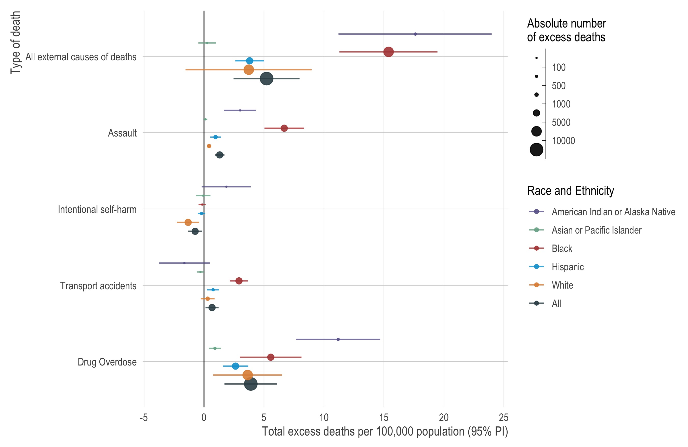

```{r, include = FALSE}
knitr::opts_chunk$set(
  collapse = TRUE,
  comment = "#>"
)
```

<!-- README.md is generated from README.Rmd. Please edit that file -->

# Excess fatal drug overdoses in California during the COVID-19 pandemic by race/ethnicity, region, and educational attainment

```{r echo=FALSE, out.width = "750px", fig.align='center'}

```

This is reproducible code for our *JAMA Internal Medicine* research letter, "[Racial and Ethnic Disparities in Excess Mortality from External Causes in the United States, March to December 2020](TODO)", which uses the data from [CDC WONDER](https://wonder.cdc.gov) estimate excess deaths from external causes in the US. The full citation is: 

> Chen R, Aschmann HE, Chen Y-H, Glymour MM, Bibbins-Domingo K, Stokes AC, & Kiang MV, Racial and Ethnic Disparities in Excess Mortality from External Causes in the United States, March to December 2020. JAMA Internal Medicine. (Forthcoming). doi: TODO

## Issues

Please submit issues [via Github](https://github.com/mkiang/excess_external_deaths/issues) or via email.

# Requirements

All analyses are conducted using `R`, which can be [downloaded via CRAN](https://cran.r-project.org/). We also recommend the use of [RStudio](https://www.rstudio.com/products/rstudio/download/) when running `R`, which will allow users to take advantage of [`renv`](https://rstudio.github.io/renv/index.html) for dependency management.

# Reproducibility 

See `./session_info.txt` for more reproducibility information. We use [`renv`](https://rstudio.github.io/renv/index.html), which ensures users have the same version of each package. 

Note that excess death estimates may not match *exactly* due to the bootstrapping procedure we used. 

# Authors (alphabetical)

-   [Hélène Aschmann](https://profiles.ucsf.edu/helene.aschmann) 
    (: 
    [\@LnAschmann](https://twitter.com/LnAschmann))
-   [Kirsten Bibbins-Domingo](https://profiles.ucsf.edu/kirsten.bibbins-domingo)
    (:
    [\@KBibbinsDomingo](https://twitter.com/KBibbinsDomingo))
-   [Ruijia Chen](https://profiles.ucsf.edu/ruijia.chen)
    (:
    [2018Ruijia](https://github.com/2018Ruijia) \|
    :
    [\@ch272n](https://twitter.com/ch272n))
-   [Yea-Hung Chen](https://yea-hung.rbind.io)
    (:
    [yea-hung](https://github.com/yea-hung) \|
    :
    [\@RuijiaChen19](https://twitter.com/@RuijiaChen19))
-   [Maria Glymour](https://profiles.ucsf.edu/maria.glymour)
    (:
    [\@MariaGlymour](https://twitter.com/MariaGlymour))
-   [Mathew Kiang](https://mathewkiang.com) 
    (: 
    [mkiang](https://github.com/mkiang) \| 
    : 
    [\@mathewkiang](https://twitter.com/mathewkiang))
-   [Andrew Stokes](https://www.bu.edu/sph/profile/andrew-stokes/) 
    (: 
    [mkiang](https://github.com/mkiang) \| 
    : 
    [\@astokespop](https://twitter.com/astokespop))
